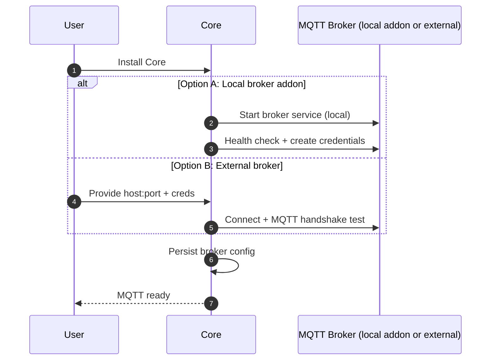
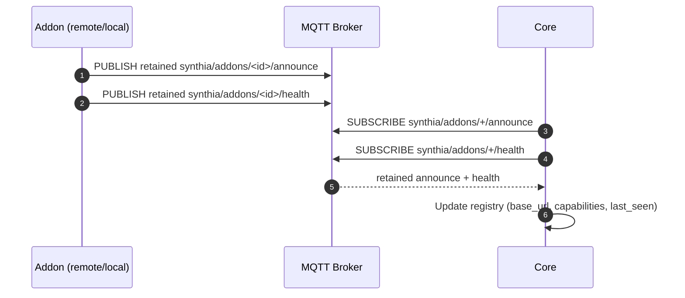
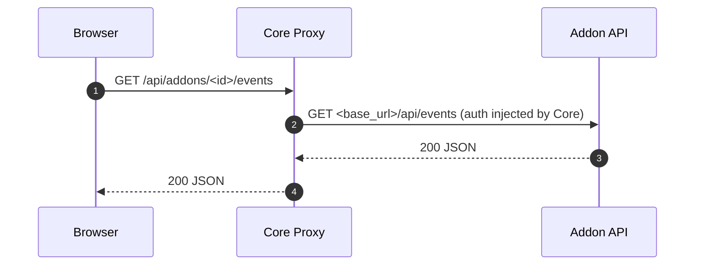
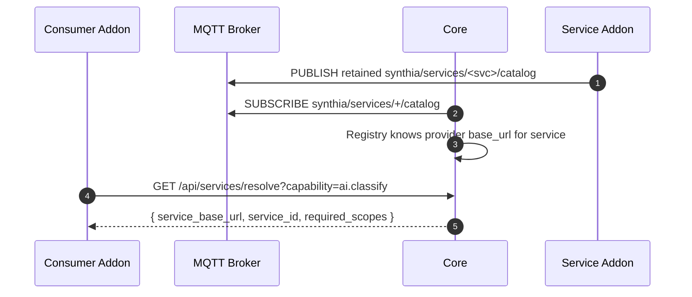
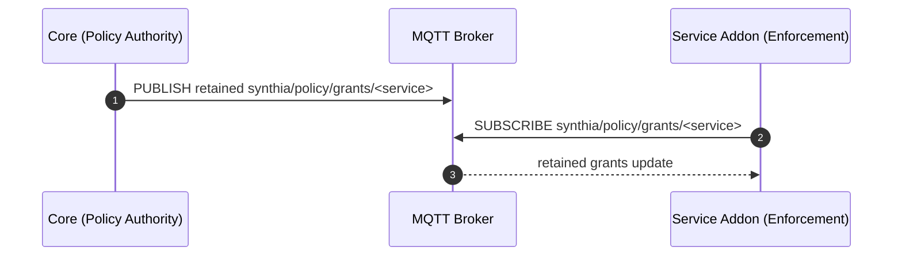
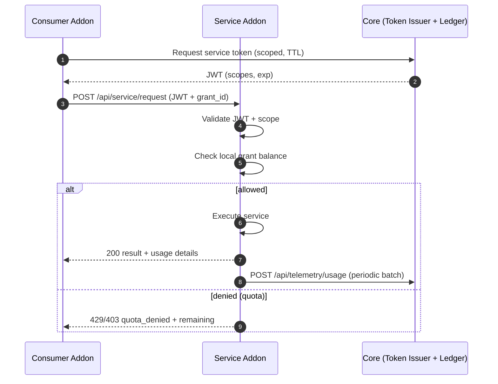
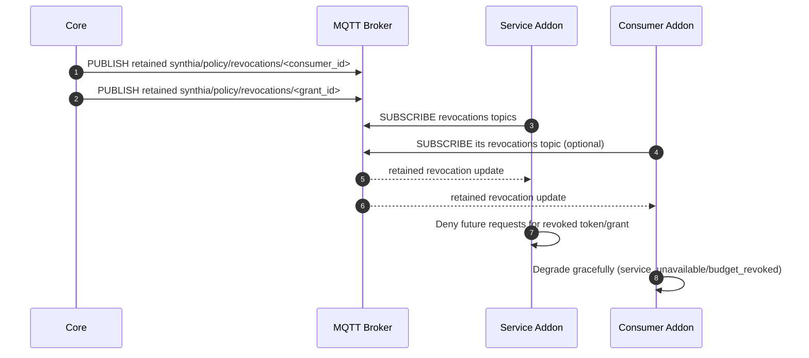
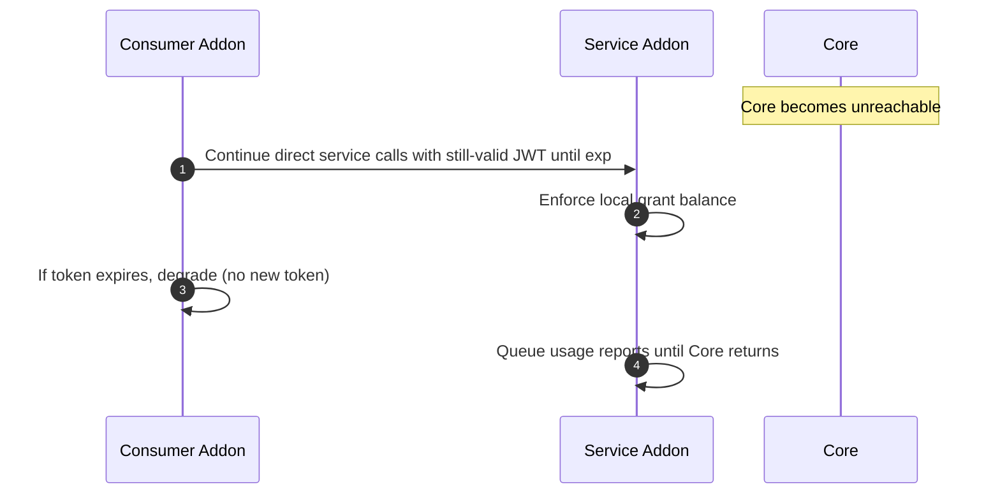

# Synthia Distributed Addons — Sequence Diagrams (General)
Version: 0.1  
Date: 2026-02-28

These diagrams use Mermaid. Paste into any Mermaid renderer (GitHub, Mermaid Live, etc.).

---

## 1) Bootstrapping MQTT (Core Install)

---

## 2) Addon Announces Itself via MQTT (Discovery)

---

## 3) Browser Uses Core Proxy to Reach Remote Addon API

---

## 4) Service Discovery (Addon Looks Up Service Location)

---

## 5) Grant Distribution (Core → Service Addon)

---

## 6) Direct Service Call with Token + Quota (Consumer → Service Addon)

---

## 7) Revocation (Core → Service Addon + Consumer)

---

## 8) Core Down (Non-Interference)

