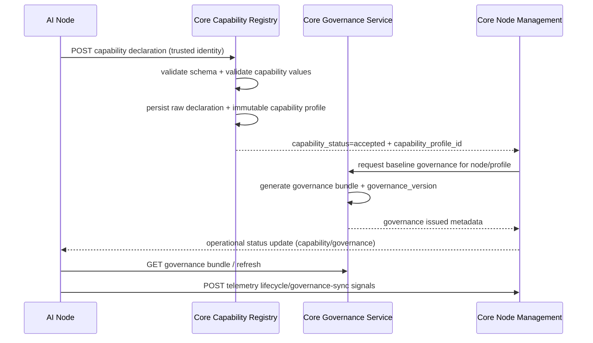

# Node Capability Activation Architecture (Phase 2)

Status: Implemented (Phase 2 baseline)  
Last Updated: 2026-03-11 17:07

## Purpose
Defines the Core-side architecture target for Phase 2 node capability activation after trust activation is complete.

This document is the source of truth for:
- capability declaration intake
- capability profile registration
- baseline governance bundle issuance
- operational-readiness state progression

This document does not define prompt/task execution logic.

## Scope Boundary
- In scope: node capability identity and governance baseline flow.
- Out of scope: task routing, policy enforcement engine internals, execution planning.

## Current Implementation State
Implemented:
- Canonical capability declaration schema module and strict validator (`backend/app/system/onboarding/capability_manifest.py`).
- Trusted node capability declaration API and accepted-profile persistence.
- Immutable capability profile registry and admin lookup APIs.
- Governance bundle issuance, distribution, and version-aware refresh APIs.
- Governance version status tracking and operational readiness projection in node registry payloads.
- Node operational status endpoint and node telemetry ingestion endpoint for lifecycle/governance runtime signals.

## Phase 2 Core Components
### AI Node (trusted)
- Submits capability declaration payload after trust activation.
- Requests governance bundle and periodic refresh.
- Reports runtime lifecycle and governance-sync telemetry.

### Core Capability Registry
- Validates and stores accepted capability declarations.
- Produces immutable capability profile records.
- Provides capability inspection for admin and future routing/policy phases.

### Core Governance Service
- Generates baseline governance bundles based on node class and accepted capability profile.
- Versions governance bundles and tracks issuance/refresh.
- Persists per-node governance status metadata (`active_governance_version`, `last_issued_timestamp`, `last_refresh_request_timestamp`).

### Core Node Management Layer
- Owns node lifecycle model and readiness progression.
- Combines trust status, capability acceptance status, and governance sync status.
- Exposes operational state to UI and node-facing status APIs.

## Phase 2 Responsibilities After Trust Activation
After Phase 1 trust activation, Core must:
1. Receive node capability declarations.
2. Validate declaration payload against canonical manifest schema.
3. Register accepted capability profile tied to `node_id`.
4. Issue baseline governance bundle for that node profile.
5. Track node operational state using lifecycle criteria.

## Interaction Flow (Target)

## Data Ownership (Target)
- Node identity/trust: existing onboarding + trust domain (`node_id`, trust token, trust status).
- Capability declaration: raw manifest payload tied to node identity.
- Capability profile: normalized immutable record derived from accepted declaration.
- Governance bundle: versioned baseline bundle tied to node + profile.
- Operational state: lifecycle projection owned by node management layer.

## Validation Boundaries (Target)
- Authentication: declaration/governance/status APIs must require trusted node identity.
- Schema strictness: manifest rejects unknown keys and unsupported versions.
- Determinism: capability acceptance logic must not silently rewrite declaration intent.
- Compatibility: schema and governance bundle versions must be explicit and comparable.

## Operational Readiness Criteria (Target)
Node is operational only when all are true:
1. trust status is `trusted`
2. capability declaration is `accepted`
3. governance bundle is issued/synced for active profile

Any missing criterion keeps node non-operational.

## API Surface (Planned)
Planned Phase 2 API groups:
- capability declaration submission
- capability profile lookup/inspection
- governance bundle fetch/refresh
- node operational status query
- telemetry ingestion for lifecycle/governance signals

Exact request/response schemas are defined in the implementation tasks that follow this architecture baseline.

## Relationship to Existing Phase 1 Docs
- Phase 1 onboarding + trust activation contract: [node-onboarding-phase1-contract.md](./node-onboarding-phase1-contract.md)
- Node onboarding architecture baseline: [node-onboarding-registration-architecture.md](./node-onboarding-registration-architecture.md)
- Trust activation payload baseline: [node-trust-activation-payload-contract.md](./node-trust-activation-payload-contract.md)
